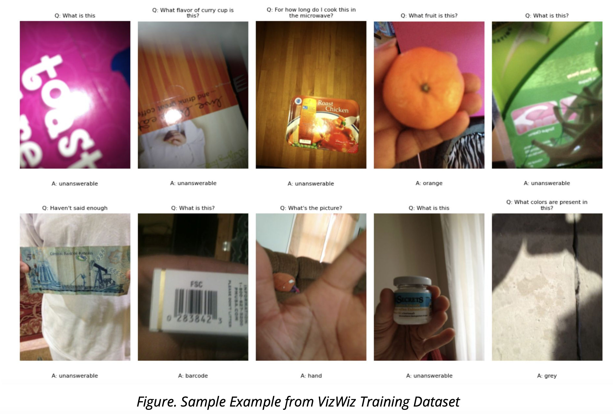
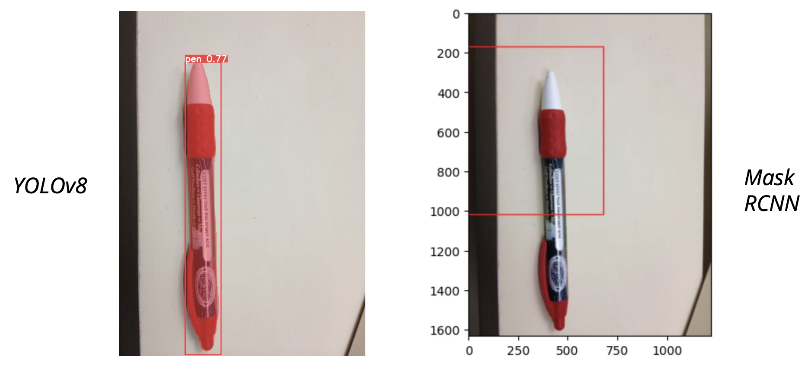

# Visual Question Answering and Object Detection
This is a Deep Learning project which implemented YOLOv8 to visually highlight relevant objects, enhancing the understanding of items with a high mAP score. 

## Table of Contents
- [Project Description](#project-description)
- [Dataset Overview](#dataset-overview)
- [Implemented Models and Results](#implemented-models-and-results)
- [Contributors](#contributors)

## Project Description
The fundamental aim of this computer vision research is to develop technology that replicates human vision, particularly focusing on creating assistive solutions for individuals who are blind or visually impaired. The project seeks to design an AI-powered visual query assistant that enables users to navigate visual challenges in their surroundings effectively.

The primary objective is to create assistive technology that allows visually impaired users to take photos, ask questions about their environment, and receive guidance on locating and identifying objects within complex scenes. This technology utilizes YOLO (You Only Look Once) for object segmentation, making it possible to detect, count, and highlight specific items in an image based on user-referenced queries.

Key features of the developed system include the ability to identify and highlight specific objects within an image, thereby assisting users in locating and understanding the placement of these items in their environment. This innovative approach enhances the independence of visually impaired users, allowing them to navigate their surroundings with greater confidence and accuracy.

## [Dataset Overview](https://www.kaggle.com/datasets/nqa112/vizwiz-2023-edition/data)
VizWiz-VQA dataset originates from a natural visual question answering setting where blind people each took an image and recorded a spoken question about it, together with 10 crowdsourced answers per visual question. Our proposed challenge addresses the following two tasks for this dataset: predict the answer to a visual question and predict whether a visual question cannot be answered.

Component:  *Annotations* (.json) , *train/val/test* ([images](/images))

Structure:
- answerable: A binary indicator denoting if the question is answerable (1) or not (0).
- image: The filename of the image related to the question.
- question: The text of the question asked about the image.
- answer_type: The type of the answer, indicating whether it is answerable or unanswerable.
- answers: A list of answers provided by crowd workers. Each answer includes:
- answer: The text of the answer.
- answer_confidence: The confidence level of
the answer (e.g., "yes", "no", "maybe").

## Implemented Models and Results
Repository Structure

- **images/**: Contains sample images we used to train the model. 

- **MaskRCNN/**: Contains `R-CNN.ipynb` file which has Two-Stage Detector, along with Mask RCNN model `model_checkpoint_epoch_49.pth`: 
    1. first proposes candidate object regions using a  `Region Proposal Network (RPN)`
    2. then refines these proposals and predicts masks.

- **YOLOv8/**: 
    1. `object-detection-yolov8.ipynb`: training the YOLOv8 model.
    2. **yolov8-seg.pt25/**: the best model across all runs by achieving the highest MAP 50 score.
    3. `YOLORUN.ipynb`: used to predict by utilizing the best model on file.

See more results [here](Deep_Learning_Project_Presentation.pdf). 

## Contributors
- Ayush Agarwal
- Kay Wu
- Kevin Li
- Xiyi Lin
